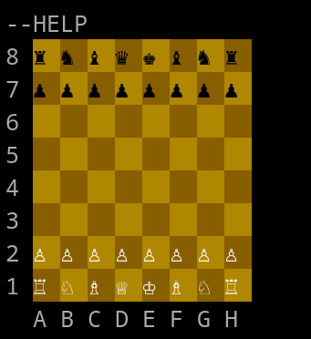

# Chess Engine in C++

A chess engine written from scratch in C++, featuring alpha-beta
search, move ordering, quiescence search, transposition tables,
Zobrist hashing, opening books, and a handcrafted evaluation function.

# Movement

The game is played and rendered in the terminal, movement consists of the initial character of chosen piece, current position, 2 non-space characters and final position. Eg: pe2--e4.

## Features

- Alpha-Beta pruning
- Iterative deepening
- Quiescence search
- MVV-LVA move ordering
- Killer Moves heuristic
- Transposition tables
- Zobrist hashing
- Opening book
- Handcrafted evaluation function
- Experimental NNUE implementation

## Evaluation Function

The engine uses a handcrafted evaluation function considering factors such as:

- Material
- Piece-square tables
- Pawn structure
- Pawn islands
- King safety
- Attacked squares
- Piece placement

## NNUE

An NNUE model was trained in Python and implemented in C++ as an
independent experiment.

The current NNUE implementation is not integrated into the main engine yet.

## Performance

The engine has an estimated playing strength of approximately 1900 Elo
based on testing against different Stockfish versions.

This estimate is informal and depends on the testing configuration.
